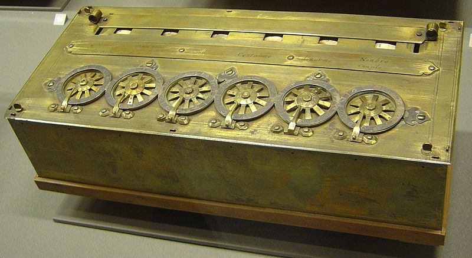
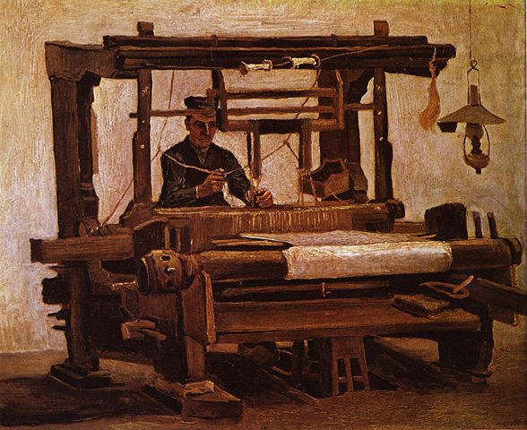
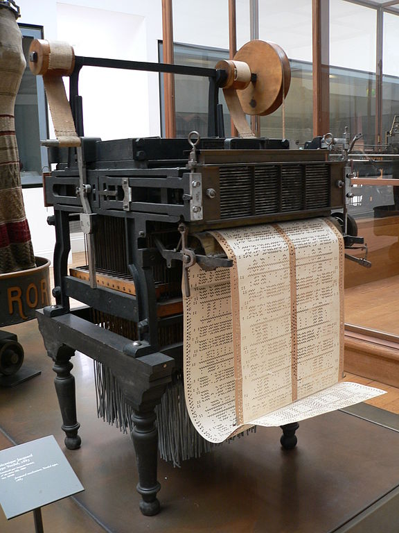
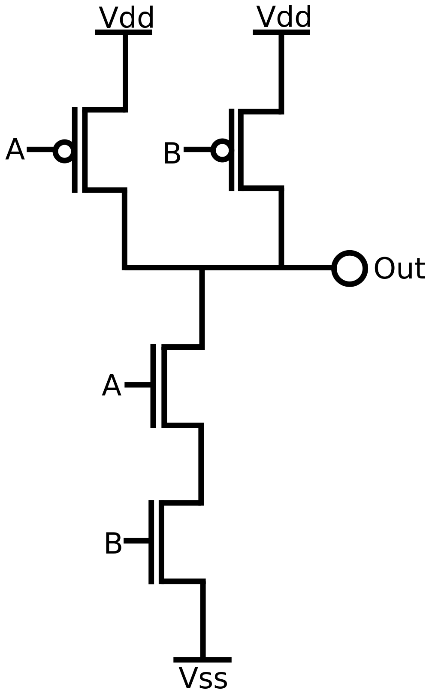

# A história do computador

> Esse artigo está disponível em formato de vídeo se você preferir! Aqui estão os links para a [parte 1](https://youtu.be/x5rC2knLhw0) e para a [parte 2](https://youtu.be/9GWvH0gVf20).

## Introdução

O que é um computador? Um computador, é uma coisa que computa, mas o que é computação? A computação normalmente é relacionada com operações matemáticas como a soma e a subtração e, se formos ver as origens do que conhecemos hoje como *computador*, vamos ver que eram máquinas que faziam esse tipo de operações que foram as primeiras a surgir.

## Pascaline

Uma das primeiras máquinas com essa capacidade foi inventada por Blaise Pascal, aquele mesmo do triângulo de Pascal na matemática e do Princípio de Pascal na física.
Ela era composta por engrenagens e alavancas e tinha exatamente as duas aplicações que eu comentei acima: somar e subtrair.

Uma imagem da máquina é essa aqui:

Se você quiser ver uma explicação detalhada de como ela funcionava, assista esse [ótimo vídeo!](http://www.youtube.com/watch?v=3h71HAJWnVU)

> Pra te localizar temporalmente, em 1642, ano em que Pascal começou a trabalhar na Pascaline (com 19 anos), Isaac Newton ainda não tinha nascido, e ninguém tinha ideia que a força que derruba uma maçã na sua cabeça é a mesma que faz a Terra girar em torno do Sol!

Trinta anos depois, Gottfried Leibniz construiu outra máquina que também multiplicava e dividia.

Os próximos 150 anos não foram muito produtivos para as máquinas de computador, parece que todos já estavam felizes em poder calcular as operações aritméticas básicas com as máquinas feitas pelos nossos colegas matemáticos.

## Tear do Jacquard

Bom, até agora as máquinas estavam servindo só pra fazer contas. Mas em 1801 uma brilhante idéia surgiu, que mudaria todo o conceito de máquinas de computar!
Seu nome era Joseph Marie Charles, também conhecido como Jacquard e ele era um tecelão e mercador!

Jacquard trabalhava com teares, e na tecelagem, alguns padrões são seguidos para formar os desenhos no tecido final. Jacquard teve a idéia de mapear esses padrões em uma sequência de cartões perfurados e adaptar o seu tear para que lesse dos cartões o estado de cada uma das agulhas [^1]: um buraco representaria que a agulha deveria ser abaixada, e uma parte normal da folha, que a agulha deveria ficar levantada.

Uma explicação detalhada de como o Tear do Jacquard funciona pode ser visto nesse [ótimo vídeo](http://www.youtube.com/watch?v=lwozgRPLVC8)

Aqui surgiu pela primeira vez o conceito de programação de computador. Mesmo sem ter nenhuma motivação matemática por trás, Jacquard teve uma idéia que revolucionaria a história dos computadores: ele inventou e conseguiu botar em prática um modo de controlar a máquina préviamente, de maneira automatizada, e não tardou muito que os matemáticos começassem a usar isso também!.

## Máquina diferencial e Máquina analítica

O próximo grande passo para as máquinas de computar foi tomado por Charles Babbage, membro da Royal Society de Londres. Ele começou a trabalhar em uma máquina diferencial com o objetivo de criar tabelas astronômicas e matemáticas que basicamente fazia o trabalho da Pascaline, só que numa escala muito maior. Depois de milhares de libras investidas pela coroa, o Babbage acabou mudando de idéia e se focou numa idéia inovadora e que moldou a computação como ela é hoje.

Em sua máquina diferencial, apenas um algoritmo era executado: o algoritmo da soma. As parcelas eram lidas por meio de cartões perfurados e eventualmente produzia uma saída em cartões ou discos de cobre. O salto para a máquina analítica foi exatamente aqui: Babbage projetou uma máquina que tinha várias funções, como somar dois números, guardar um número em um meio de armazenamento, resgatar um número do armazenamento, etc, e mais do que isso, tais funções podiam ser escolhidas assim como se escolhia o número a ser somado.
Somando isso à técnica de entrada criada pelo Jacquard, agora podíamos escrever em cartões uma grande sequência de passos pequenos que gostaríamos que fosse executado e guardar essa sequência para ser executada quantas vezes quiséssemos!

Pode parecer pouco, mas é impressionante a quantidade de coisas que pode ser feito somando números e guardando as respostas! Na verdade, ignorando questões de velocidade e algumas operações específicas, o processador que você está usando agora é muito similar à máquina do Babbage!

Note que agora o papel da programação aumentou ainda mais! Quando antes programar o tear do Jacquard era apenas colocar os dados em uma ordem que gerasse um tecido com um padrão específico, agora programar a máquina analítica era uma questão diferente, envolvia não só inserir os dados, como também manipular quais instruções deveriam ser executadas a cada passo!

Nesse contexto, Babbage conheceu uma mulher chamada Augusta Ada Byron, filha do famoso poeta inglês Lord Byron. Ada Lovelace, como é conhecida hoje em dia, começou a escrever anotações e programas para a máquina analítica antes mesmo dela estar pronta e entrou pra história como a primeira programadora de computador.

Acontece que o Babbage era um cara meio difícil, e acabou encontrando vários problemas pelo caminho, inclusive com o financiamento da Coroa, e a sua máquina nunca foi finalizada. O Tannembaum (cujo livro eu usei de referência pra boa parte desse artigo) diz que as ideias do Babbage estavam muito afrente do que a tecnologia da época era capaz de produzir. Mesmo assim, ele acabou tendo uma enorme importância e, como foi dito, a estrutura da maioria dos computadores é bastante similar à máquina analítica.

## Interlúdio Científico

Parece loucura dizer que até esse momento, por volta de 1840, a idéia do computador estava praticamente pronta, esperando apenas que os físicos dessem um jeito do processo ficar mais rápido, estável e automático.

Até agora tudo era feito mecânicamente. Pra somar dois números, ou carregar um número do armazenamento, algum operador tinha que ir lá, puxar uma alavanca, que ia girar algumas engrenagens, junto com algum outro sistema para fazer o "vai um" da soma, o que não só requer um certo esforço físico, mas também requer manutenção, como por exemplo passar graxa, substituir uma eventual peça quebrada. Também existem outros problemas, como o grande espaço ocupado, a chance de um erro humano e ainda por cima demora um tempão!

## Portas lógicas e sua implementação

Para se criar um computador, vários meios podem ser utilizados para atingir os objetivos principais de manipulação de dados. Agora eu vou mostrar alguns jeitos de se construir uma porta lógica, que é uma pequena peça da qual um computador é construído.

[Essa](http://www.youtube.com/watch?v=Y2UVb7QfMqY) é uma porta lógica que utiliza a rotação de eixos como entrada e saída. Dependendo da rotação que colocamos na parte direita, uma rotação específica aparecerá do lado esquerdo.

Nesse [segundo exemplo](http://www.youtube.com/watch?v=qNO5pmh53l0), uma bóia é utilizada para criar uma porta lógica NÃO.

E nesse [outro vídeo](http://www.youtube.com/watch?v=r7N3K8ulEEM), três portas lógicas diferentes são criadas no jogo Minecraft, utilizando tubos, alavancas, registros, bóias, fontes de água. Isso funciona de um jeito muito criativo, utilizando a força da gravidade e do empuxo para obter o resultado desejado.

O trabalho e o custo de se criar e utilizar uma máquina como a do Babbage não valia a pena, mas no próximo século, os físicos estavam estudando um fenômeno que ainda não se entendia muito bem, mas que iria ter uma esmagadora influência em toda a nossa civilização: o eletromagnetismo.

## Um pouco sobre eletromagnetismo

Agora vamos falar um pouco sobre o desenvolvimento científico que possibilitou transformarmos máquinas gigantes, com alavanca e engrenagens em pequenos chips que cabem facilmente no seu bolso.

Para o nosso intuito, o eletromagnetismo é um fenômeno parecido com a gravidade. Assim como objetos que tem massa acabam criando um campo gravitacional que fazem com que as coisas caiam, um campo elétrico faz com que elétrons "caiam" para um lugar com menos potencial.

Em uma analogia simples, do mesmo jeito que a água vai cair, ou seja, ir em direção ao centro da Terra, a carga em um circuito elétrico vai "cair" até o ponto de menor potencial. E do mesmo jeito que a água pode ir passando por um tubo e interagindo com alavancas por exemplo, a carga elétrica vai passando pelo circuito e gastando sua energia, seja acendendo uma lâmpada ou mesmo te dando um choque!

## Bom, mas voltando aos computadores...

Depois de um século inteiro estudando esse fenômeno, estava começando a se tornar possível criar um computador elétrico, que usaria um circuito parecido com esse:

> Para se aprofundar no tema, recomendo esse excelente [vídeo teórico](https://www.youtube.com/watch?v=95kv5BF2Z9E) e esse outro excelente [vídeo prático](https://www.youtube.com/watch?v=AGJhCSjwDwI) (ambos em inglês).

ao invés das alavancas e engrenagens que estávamos acostumados.

## Conclusão

É claro que no último século, muito se evoluiu nas tecnologias que envolvem a construção de computadores mas as funções fundamentais dos computadores, continuam as mesmas: somar, guardar números e resgatar números. É claro que o tamanho desses componentes vem diminuindo sem parar no último século e hoje em dia computadores de poder impensável nos maiores laboratórios há 40 anos cabem na palma da nossa mão.

Novas pesquisas também estão sendo feitas em áreas que podem mudar esses fundamentos, principalmente em computação quântica, e abrem a possibilidade de alterar completamente como nos relacionamos com essa máquina que vem fazendo parte da nossa história há vários séculos.

[^1]: Não sei se o nome em português é agulha mesmo.

This work is licensed under the Creative Commons Attribution-ShareAlike 4.0 International License. To view a copy of this license, visit http://creativecommons.org/licenses/by-sa/4.0/ or send a letter to Creative Commons, PO Box 1866, Mountain View, CA 94042, USA.

### Referência geral:

> Tanenbaum, Andrew S., "Structured computer organization", Chapter 1 - Introduction
http://www.youtube.com/watch?v=GcDshWmhF4A

### Imagens:

[Pascaline](https://commons.wikimedia.org/wiki/File:Arts_et_Metiers_Pascaline_dsc03869.jpg)

[Van Gogh - Weber am Webstuhl](https://commons.wikimedia.org/wiki/File:Vincent_Willem_van_Gogh_139.jpg)

[Jacquard Loom](https://commons.wikimedia.org/wiki/File:Jacquard_loom_p1040320.jpg)

[Ada Lovelace](https://commons.wikimedia.org/wiki/File:Ada_Lovelace_color.svg)

[CMOS NAND Gate](https://commons.wikimedia.org/wiki/File:CMOS_NAND.svg)